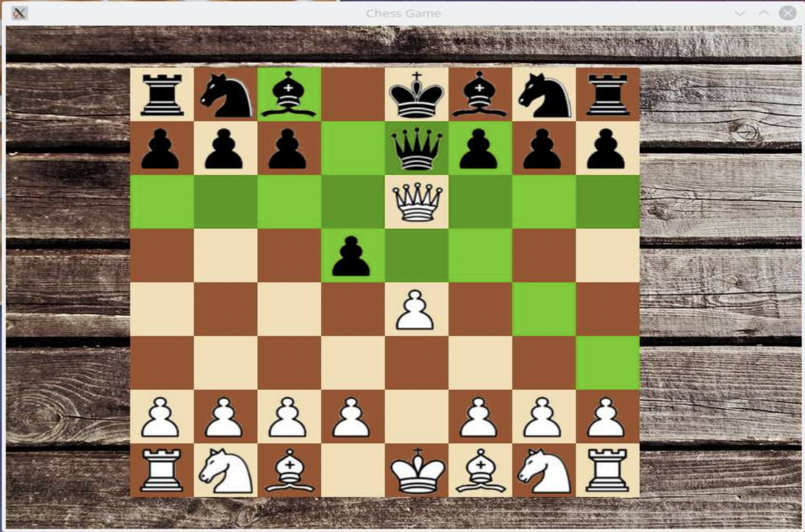

# C++ Chess Simulation

This is a chess game implementation written in C++ as part of a C++ Rush Course at [TUM](https://www.tum.de/en/).

## Project Organization

The implementation of the game engine could be found in chessBoard.(cpp|hpp), while implementation of other classes (chess pieces, error handling class) could be found in /src

